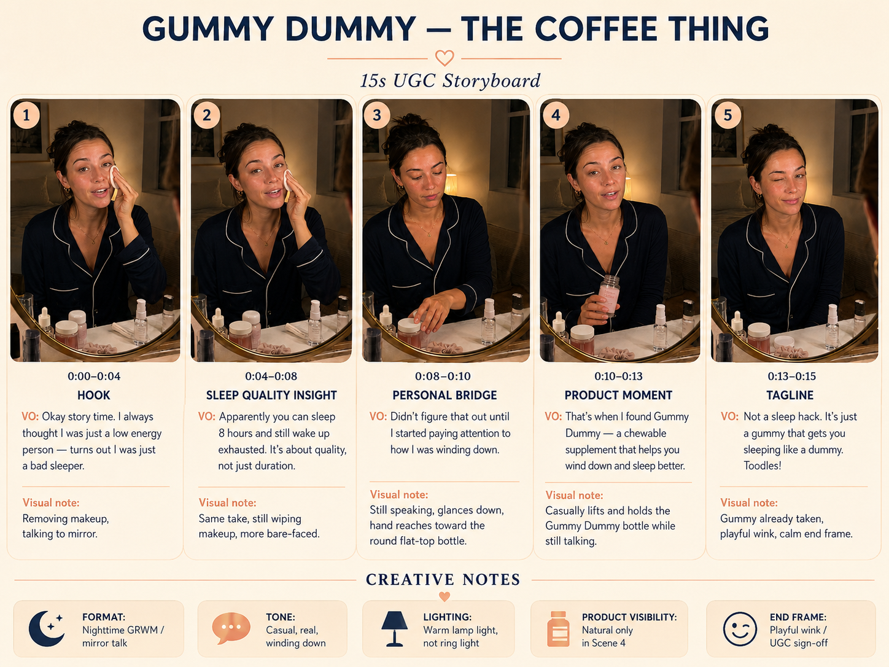
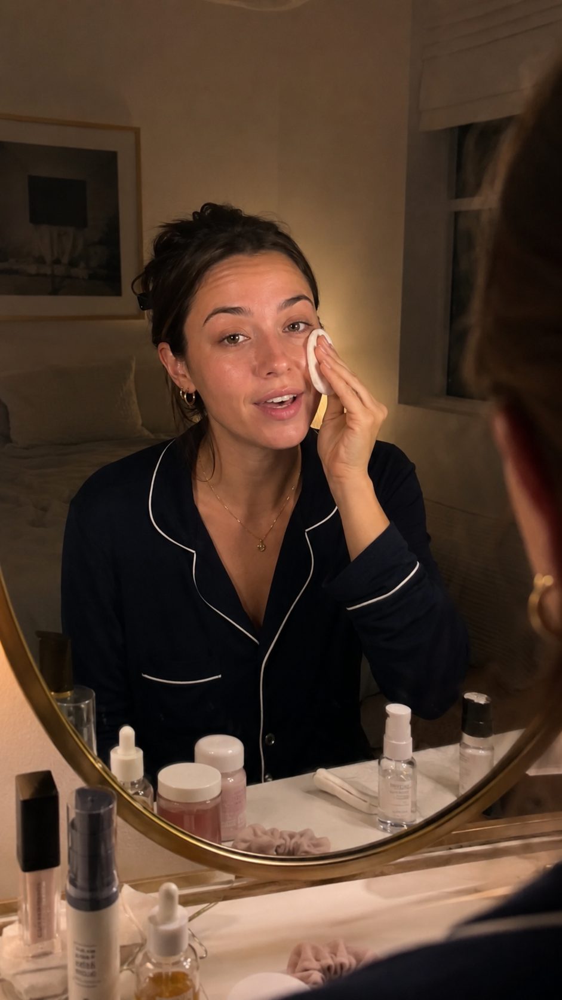
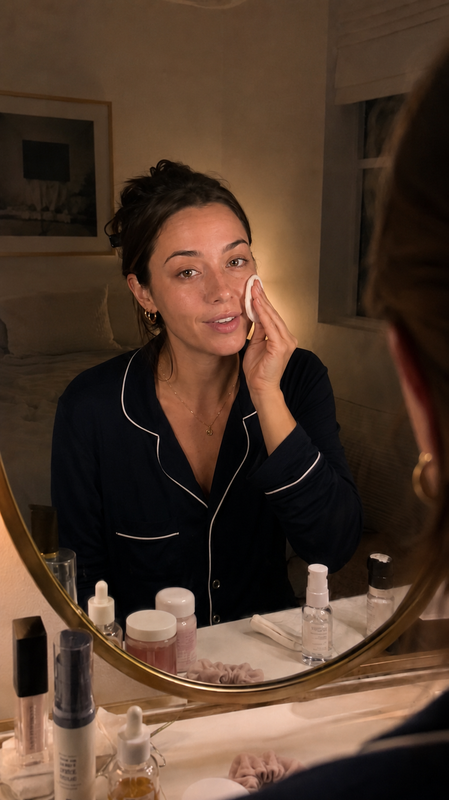
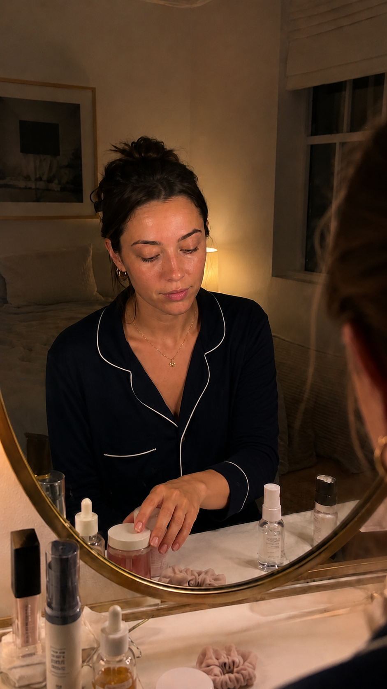
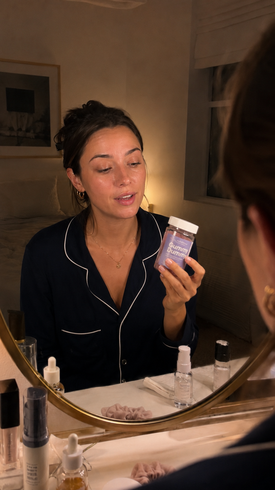
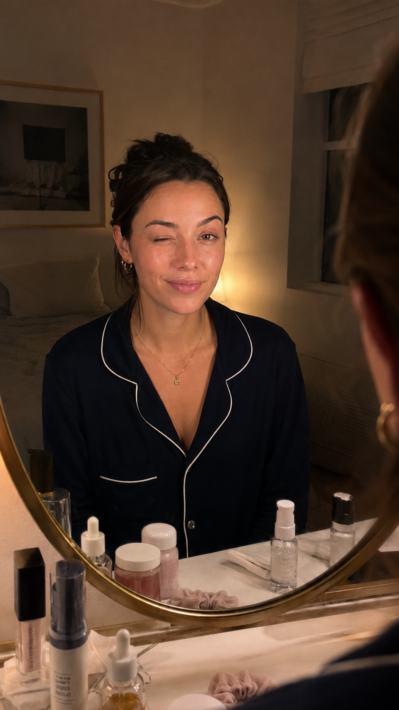

# UGC-v1 — Gummy Dummy: The Coffee Thing

**By:** Leonard Tan  
**Format:** 15s AI-assisted UGC ad  
**Platform fit:** TikTok, Instagram Reels, YouTube Shorts  
**Final video:** [Watch on YouTube Shorts](https://youtube.com/shorts/E8GzTk8ZbcE?feature=share)  
**Built in:** One evening  

## Final video

[Watch the final YouTube Short](https://youtube.com/shorts/E8GzTk8ZbcE?feature=share)

For context on production limitations and what I would improve next, see [final-video.md](./final-video.md).

## What this is

This is a quick proof-of-work creative project showing how I can take a product angle and turn it into a short-form UGC ad concept, storyboard, AI prompt workflow, and finished video direction.

This was made quickly across free / limited AI platforms, without a full professional edit pass. The goal was not to pretend this is a polished client campaign. The goal was to show how I think, how I structure a creative idea, and how I can execute fast with limited resources.

## Creative angle

Most sleep supplement ads go straight into benefits. I wanted to start with a relatable reframe instead:

> “I always thought I was just a low energy person — turns out I was just a bad sleeper.”

The product enters only after the story has already created a reason to care.

## Final voiceover

> Okay story time. I always thought I was just a low energy person — turns out I was just a bad sleeper.
>
> Apparently you can sleep 8 hours and still wake up exhausted. It's about quality, not just duration.
>
> Didn't figure that out until I started paying attention to how I was winding down.
>
> That's when I found Gummy Dummy — a chewable supplement that helps you wind down and sleep better.
>
> Not a sleep hack. It's just a gummy that gets you sleeping like a dummy. Toodles!

## Storyboard

| Scene | Time | Purpose | Visual |
|---|---:|---|---|
| 1 | 0:00–0:04 | Hook | Makeup removal mirror talk |
| 2 | 0:04–0:08 | Sleep-quality insight | Same take, more bare-faced |
| 3 | 0:08–0:10 | Personal bridge | Glances down toward routine items |
| 4 | 0:10–0:13 | Product moment | Casually lifts the Gummy Dummy bottle |
| 5 | 0:13–0:15 | Tagline | Calm wink / “Toodles” sign-off |

## Scene frames

| Scene 1 | Scene 2 | Scene 3 | Scene 4 | Scene 5 |
|---|---|---|---|---|
|  |  |  |  |  |

## Workflow

1. Pick a product and consumer context.
2. Find a relatable problem reframe.
3. Write a short UGC-style script.
4. Break the script into visual beats.
5. Generate still frames for each scene.
6. Use AI motion prompts to animate each beat.
7. Assemble the short clips into a vertical video.
8. Review what worked, what broke, and what to improve next.

## Tools / constraints

This version used free / limited AI tools and Dreamina AI with Seedance 1.5 Pro / legacy-style generation. It was built from individual images and short AI motion chunks.

Because this was done quickly and cost-consciously, there are visible production tradeoffs.

## Known limitations

- Different platforms caused inconsistent color grading.
- Some clips have different lighting / color gradients.
- Some camera movement appears even though the prompt asked for static phone framing.
- Some words feel compressed because smaller 4s chunks were used instead of longer 8s chunks.
- The gummy interaction is imperfect — the gummy appears taken out without a realistic opening action.
- Product handling could be improved with more detailed prompts, better tools, or manual editing.
- This did not receive a full editing, grading, caption, or sound pass.

## What I would improve next

With more time and better resources, I would:

- Use one consistent AI video platform/model for the whole ad.
- Generate longer clips for smoother pacing.
- Lock the camera more strictly.
- Match color across every scene.
- Improve hand/product interaction logic.
- Add native captions and a cleaner final edit.
- Produce 3–5 hook variations for testing.

## What this shows

Even with limited tools and one evening of production time, I can move from idea to finished proof-of-concept. With better tools, more time, and a stronger editing pass, the same workflow can produce cleaner and more scalable ad creative.
